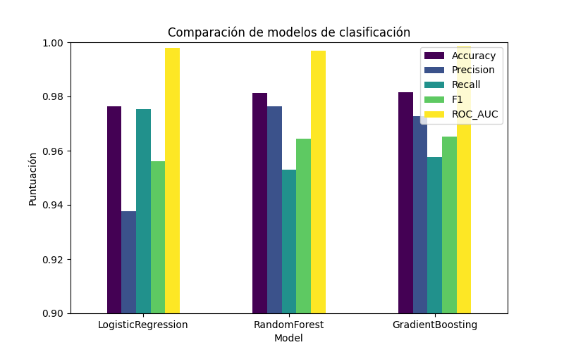
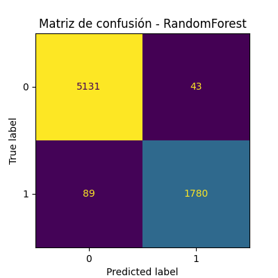
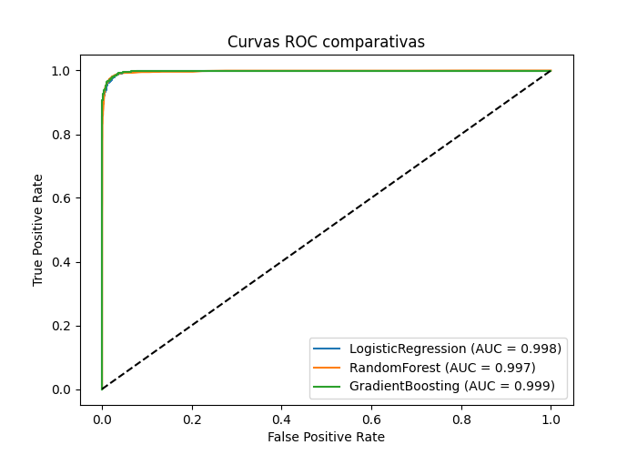
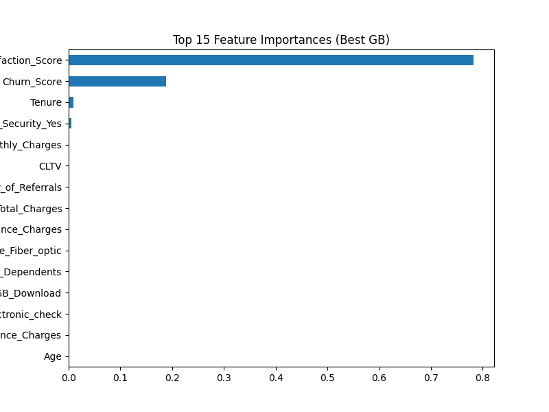

# Predicción de Abandono de Clientes en Telecomunicaciones

**Proyecto de Clasificación Supervisada**
Autor: *Yeison – Universidad Icesi*
Fecha: *Octubre 2025*

---

## Introducción

El presente proyecto tiene como objetivo diseñar e implementar un sistema de **clasificación supervisada** para predecir el **abandono de clientes (churn)** en una empresa de telecomunicaciones.
El propósito es identificar los factores que influyen en la decisión de un cliente de abandonar el servicio, permitiendo estrategias preventivas de retención.

El dataset base, `Telecom_Customer_Churn_Complete.csv`, contiene información demográfica, de servicios contratados, facturación y satisfacción del cliente.
El problema se aborda como una **clasificación binaria**, donde:

> **Churn:** 1 = cliente que abandona el servicio, 0 = cliente que permanece.

---

## Análisis Exploratorio y Preprocesamiento

El dataset inicial contenía 33 columnas. Tras la integración y limpieza, se generaron 65 variables relevantes.
Se aplicaron los siguientes pasos:

* **Eliminación de columnas redundantes:** (`Customer ID`, `Service ID`, `LoyaltyID`, `Status ID`).
* **Tratamiento de valores nulos:** imputación con valores más frecuentes o etiquetas como `"No Offer"` o `"Unknown"`.
* **Codificación:**

  * Variables categóricas → *One-Hot Encoding*
  * `Gender` → binaria (`Male = 1`, `Female = 0`)
  * `Churn` → binaria (`Yes = 1`, `No = 0`)
* **Normalización de nombres:** reemplazo de espacios por guiones bajos.
* **Control de correlación:** se conservaron las variables con mayor relevancia como `Monthly Charges`, `Tenure`, `Total Revenue`.

### Balance de clases

Se mantuvo la proporción original entre clientes activos y desertores, aplicando `class_weight='balanced'` en los modelos.

---

## Modelos Implementados

| Modelo                  | Tipo                | Justificación                                                                         |
| ----------------------- | ------------------- | ------------------------------------------------------------------------------------- |
| **Regresión Logística** | Lineal              | Modelo base interpretable, ideal para establecer una línea base.                      |
| **Random Forest**       | Ensamble (árboles)  | Capta relaciones no lineales y maneja bien datos heterogéneos.                        |
| **Gradient Boosting**   | Ensamble secuencial | Maximiza el rendimiento mediante aprendizaje iterativo y minimiza errores residuales. |

---

## Estrategia de Validación

Se aplicó una **validación cruzada estratificada** (`StratifiedKFold`) con **k = 5** pliegues.
Esta estrategia asegura que cada subconjunto de entrenamiento y prueba mantenga la misma proporción de clases, garantizando una evaluación justa y estable.

Las métricas se obtuvieron con `cross_val_predict` para generar predicciones “out-of-fold”, reduciendo el riesgo de sobreajuste.

---

## Resultados

### Métricas Globales

| Modelo              | Accuracy   | Precision | Recall     | F1         | ROC AUC    |
| ------------------- | ---------- | --------- | ---------- | ---------- | ---------- |
| Logistic Regression | 0.9763     | 0.9373    | 0.9759     | 0.9562     | 0.9980     |
| Random Forest       | 0.9814     | 0.9764    | 0.9529     | 0.9645     | 0.9970     |
| Gradient Boosting   | **0.9817** | 0.9728    | **0.9577** | **0.9652** | **0.9985** |

---

### Comparación visual de modelos

---

### Matrices de confusión

|                       Regresión Logística                      |                    Random Forest                   |                      Gradient Boosting                     |
| :------------------------------------------------------------: | :------------------------------------------------: | :--------------------------------------------------------: |
|  |  |  |

---

### Curvas ROC

---

### Importancia de características del modelo final

---

## Comparación y Conclusiones

### Comparación general

* Todos los modelos superaron el **97% de exactitud (Accuracy)**.
* **Gradient Boosting** obtuvo el mejor equilibrio general entre precisión, recall y AUC.
* **Random Forest** fue estable pero con menor recall.
* **Regresión Logística** se destaca por su interpretabilidad y simplicidad.

---

### Conclusiones

El modelo final de **Gradient Boosting** se considera el más adecuado para predecir el abandono de clientes gracias a su alto desempeño y capacidad para modelar relaciones no lineales.

**Variables más influyentes:**
`Monthly Charges`, `Tenure`, `Contract`, `Internet Type`, `Payment Method`, `Total Revenue`.

---

### Recomendaciones

1. Usar el modelo como sistema de alerta temprana de abandono.
2. Aplicar herramientas de interpretabilidad como **SHAP** o **LIME**.
3. Reentrenar el modelo periódicamente para mantener su precisión.

---

### Limitaciones y Mejoras Futuras

* Persistencia de un leve desbalance de clases (posible uso de **SMOTE**).
* Evaluar modelos avanzados como **XGBoost** o **LightGBM**.
* Incluir variables temporales y de comportamiento del usuario.

---

**Resumen final:**
El modelo de Gradient Boosting presenta un rendimiento sólido (AUC ≈ 0.9985), lo que lo convierte en una herramienta efectiva para anticipar la fuga de clientes y apoyar estrategias de retención.
